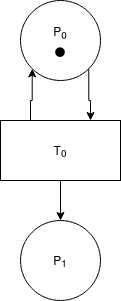

# Non-deterministic Transitioning Petri Nets

A graph based concurrent middle ware written in Rust.

This repository aims to implement colored non-deterministically transitioning Petri nets specified in [Petri Nets for Concurrent Programming](https://arxiv.org/abs/2208.02900).

## Intro

### What is a Petri Net?

A Petri net is a directed bipartite graph that describes a concurrent state machine.

There exists two types of nodes in a Petri net: places and transitions. On a given Petri net, there may exist tokens. Tokens are atomic elements which exist at places. The distribution of tokens in a Petri net at a given moment in time is the state of the Petri net. Transitions move tokens from places to places. When a transition moves tokens, it is said to "fire". A transition firing corresponds to a state transition in a state machine. Edges in Petri nets may have weights to indicate thresholds in the case of a place to transition edges and number of tokens produced in transition to place edges. Petri nets where originally used as a way to describe complex chemical reactions.

**Note: Tokens are not necessarily conserved**

Consider a Petri net that models the chemical reaction: `2H2 + O2 → 2H2O`.

|              |
|----------------------------------------------|
| Before combustion                            |

|  |
|----------------------------------------------|
| After Combustion                             |

| |
|----------------------------------------------|
|State graph of the `2H2 + O2 → 2H2O` Petri net|

### More Than Just a State Machine

Petri nets are more powerful than state machines. A state machine, for the purposes of this project is just a directed graph, where each node represents a state and edges represent possible state transitions.

A Petri net can represent an infinite state machine, these are said to be "unbounded".

||
|----------------------------------------|
| An unbounded Petri net                 |

|      |
|------------------------------------------------|
| Infinite state graph of an unbounded Petri net |

### Color

Petri nets are not turing complete. Early on this limited their usefulness, and soon tokens with color were added, generalizing Petri nets as Colored Petri nets. Colored Petri nets with a finite number of allowed colors are not Turing complete. Colored Petri nets with an infinite number of allowed colors may be Turing complete.

In a colored Petri net, each token has a given "color". Transitions can have arbitrary rules about which sets of colored tokens they will fire on and which colored tokens they will output. This makes concise encoding of a Petri net possible.

| |
|-----------------------------------------|
| A colored Petri net                     |

### Non-deterministic Transitioning Petri nets

We find that in order to make concise, useful Petri nets, we must generalize them to non-deterministic transitioning Petri nets (NTPnets).

In an NTPnet, transitions have multiple mapping functions from input tokens to output tokens. During execution, a subset of the valid mappings is selected to fire non-deterministically.

## What is a Concurrent Program?

Concurrent programs are programs with multiple active threads of execution. Some parallel programs may have their threads of execution run at the same time, if the resources for it are available. Often times, there are complex synchronization / communication protocols between these threads of execution. All parallel programs are concurrent, but not all concurrent programs are parallel programs.

### Petri Net Program

We define a Petri net program is a program where all concurrent elements are represented as tokens and all computations are represented as transitions. In this project, we assume that all computations execute in finite time and do not panic.

## Execution of Petri nets

Some Petri nets may be executed concurrently.

### Partial Ordering

Petri nets that are not executed concurrently are executed in partial order. In partial order computations, the relative order of some computations is important, but others are not.

### Concurrency

Some Petri nets may be executed concurrently, where the ordering is not important.

### Maximal Concurrency of a Petri Net

Maximal concurrency allows for the maximum possible parallelization of a concurrent Petri net program, and given some assumptions (context switches are negligible and there are always available hardware interfaces), it is the optimal execution of the program.

### Work Clusters

Work clusters are partitions in a Petri net transitions. Transitions inside a work cluster are fired with partial ordering to each other. Work clusters are executed concurrently with each other. If two transitions are share an input place, they must be in the same work cluster.

|     |
|----------------------------------------|
| A Petri net with invalid work clusters |

| |
|--------------------------------------|
| A Petri net with valid work clusters |

### Solving for Maximal Concurrency

To find the maximal concurrent execution of a Petri net, we find the maximum number of valid work clusters.